# Práctica: Escape del Laberinto - Diseño Colaborativo de Aplicaciones 🎮

> **Autores**
> - Esther Peral Soler
> - Hugo Redondo Valdés
> - Alejandro Montoya Aracil
> - Juan Fernando Ganim Iborra

---

# Compilación
~~~
g++ -std=c++17 -o game src/*.cpp -I src -I vendor/include -L vendor/lib -lraylib -lGL -lm -lpthread -lrt -lX11
~~~

## 1. ¿Qué es GitHub Flow? 🌿

**GitHub Flow** es un flujo de trabajo simplificado para Git, centrado en la colaboración y despliegues continuos. A diferencia de GitFlow, que tiene múltiples ramas de soporte (`develop`, `release`, `hotfix`), GitHub Flow se basa en:

- Una **rama principal (`main`)** que siempre contiene código estable y listo para producción.
- **Ramas de trabajo temporales** para nuevas funcionalidades o correcciones.
- **Pull Requests (PRs)** para discutir y revisar cambios antes de integrarlos en `main`.

### Diferencias clave con GitFlow

| Aspecto              | GitFlow                              | GitHub Flow                                         |
| -------------------- | ------------------------------------ | --------------------------------------------------- |
| Rama principal       | `main` y `develop`                   | Solo `main`                                         |
| Ramas auxiliares     | `feature/*`, `release/*`, `hotfix/*` | `feature/*`, `bugfix/*`, `experiment/*` (flexibles) |
| Releases             | Preparación en ramas `release`       | Merge directo a `main` mediante PR                  |
| Hotfixes             | Ramas `hotfix`                       | Igual que cualquier PR, rápido merge a `main`       |
| Complejidad          | Media-alta                           | Baja, más simple y moderno                          |
| Integración continua | Opcional                             | Ideal para CI/CD y despliegues frecuentes           |

---

## 2. Tipos de ramas en GitHub Flow 🌱

- **`main`**
  - Rama de producción.
  - Todo lo que esté aquí **debe ser estable** y listo para ejecutar.

- **Ramas de trabajo**
  - Se crean para desarrollar algo **específico**.
  - Nombres típicos de ejemplo:
    - `feature/nueva-mecanica`
    - `bugfix/correccion-colisiones`
    - `experiment/ia-nueva`
  - Se crean desde `main` y se fusionan mediante **Pull Request**.

---

### 3. Flujo de trabajo paso a paso (¡Importante!) ⚡

Simulando el desarrollo de la práctica "Escape del Laberinto":

a) Crear una rama de trabajo
Supongamos que vamos a implementar la mecánica de **recoger llaves**:
~~~~
# Situados en main
git checkout main
# Crear nueva rama feature
git checkout -b feature/recoger-llaves
~~~~

Trabajamos en esta rama hasta tener cambios funcionales.
~~~~
# Añadir archivos modificados
git add .
git commit -m "Implementa la mecánica de recoger llaves"
git commit -m "Añade animación al recoger llave"
~~~~

b) Push de la rama y Pull Request
~~~~
# Enviar la rama al repositorio remoto
git push origin feature/recoger-llaves
~~~~
- Abrimos un **Pull Request (PR)** en GitHub desde `feature/recoger-llaves` hacia `main`
- El equipo revisa el código, se hacen comentarios (o no) y se sugieren mejoras (o no).
- Una vez aprobado → merge.

c) Fusionar la rama a `main`
GitHub permite hacer **merge directamente desde la web** (mucho más cómodo), o desde terminal:
~~~
# Desde terminal
git checkout main
git pull origin main
git merge feature/recoger-llaves
git push origin main
~~~

Tras fusionar, se **borra la rama temporal**:
~~~
git branch -d feature/recoger-llaves
git push origin --delete feature/recoger-llaves
~~~

Esto también se puede hacer con un *click* desde el propio Github, pero solo la rama en remoto, la local se sigue teniendo que borrar a mano.

d) Ejemplo de ciclo completo en GitHub Flow
1. Crear rama: `feature/mover-jugador`.
2. Implementar la mecánica de movimiento.
3. Hacer commits frecuentes.
4. Push a GitHub.
5. Abrir Pull Request hacia main.
6. Revisiones y correcciones.
7. Merge a main.
8. Borra rama temporal.

### Resumen y Cheatsheet básico
Como empezar:
~~~
# Creación y cambio a una nueva rama en la misma instrucción
git checkout -b feature/nombre

# Añadir cambios
git add . && git commit -m "mensaje descriptivo"

# Subir nueva rama al repositorio remoto
git push -u origin feature/nombre

# Cambiar a rama donde queremos hacer el merge y hacerlo (mucho mejor desde GitHub con PR)
git checkout main
git merge feature/nombre
~~~

Una vez tenemos el trabajo terminado en una rama y hecho el merge junto con el pull request en la rama principal, debemos integrarlo en el repositorio local y borrar la rama.
~~~
git checkout main
git pull
git branch -d <nombre-rama>

# Borra las ramas en local que ya no existan en origin (actualiza el estado local con respecto a origin)
git remote prune origin
~~~

## 4. Buenas prácticas de GitHub Flow
1. **Commits pequeños y descriptivos**:
`"Añade animación de recoger llaves"` es mejor que `cambios varios`.
2. **Ramas cortas y enfocadas**:
Una rama = una funcionalidad o bug.
3. **Merge solo mediante Pull Request**:
- Permite revisión de código.
- Facilita la integración de tests CI/CD.
4. **Eliminar ramas temporales tras merge**:
Mantiene el repositorio limpio.
5. **Test automáticas antes del merge** (esto vendrá en la parte del CI/CD):
Evita romper `main`.
6. **Actualiza tu rama antes de merge**:
  ~~~
  git pull origin main
  ~~~

  para resolver conflictos localmente.

Para el seguimiento de bugs y tareas, utilizamos **GitHub Issues**, integrado directamente en nuestro repositorio. Esto nos permite asociar cada incidencia o mejora a Pull Requests, commits y milestones, manteniendo todo el historial del proyecto organizado.

## 5. Mini-guía de Bugtracking con GitHub Issues 🐛
### Conceptos clave
- **Issue:** Un bug, tarea o mejora que debe ser resuelta.
- **Etiqueta (Label):** Categoriza el issue, por ejemplo `bug`, `feature`, `enhancement`, `UI`.
- **Asignado (Assignee):** Persona responsable de resolver el issue.
- **Estado:** `Open` (abierto), `In Progress` (en progreso), `Closed` (cerrado).

### Ejemplos prácticos
| Issue | Estado | Etiquetas | Asignado |
|-------|--------|-----------|----------|
| `#12: Jugador atraviesa paredes` | ⚠ Abierto | `bug`, `high-priority` | Esther |
| `#15: Añadir sonidos al recoger objetos` | ✅ Cerrado | `feature`, `audio` | Hugo |
| `#18: Mejora IA enemigos` | ⏳ En progreso | `enhancement`, `AI` | Alex |

### Información necesaria en un Issue 📝

Al crear un **issue** en GitHub Issues, especialmente para un bug, se recomienda documentar al menos los siguientes campos para facilitar su resolución y seguimiento:

- **Gravedad del error (Severity):** Indica el impacto del bug en la jugabilidad o funcionamiento del juego. Ejemplos: `Alta`, `Media`, `Baja`.
- **Cómo reproducir el error:** Detalla paso a paso cómo generar el bug, para que otros miembros puedan replicarlo. Ejemplo:
  1. Iniciar partida.
  2. Mover al jugador hacia la esquina superior derecha.
  3. Intentar atravesar la pared.
- **Usuario que detectó el bug:** Nombre del miembro del equipo que encontró el problema.
- **Estado del bug (Status):** Indica el progreso actual del issue. Ejemplos: `Open` (abierto), `In Progress` (en progreso), `Closed` (cerrado).

**Ejemplo de issue completo:**

| Campo                | Ejemplo                                  |
|---------------------|------------------------------------------|
| Título               | Jugador atraviesa paredes                 |
| Gravedad             | Alta                                      |
| Cómo reproducir      | 1. Iniciar partida 2. Mover jugador a la esquina superior derecha 3. Intentar atravesar pared |
| Usuario que lo detectó | Esther                                   |
| Estado               | Open                                      |
| Etiquetas            | `bug`, `high-priority`                    |
| Asignado a           | Esther                                    |

### Buenas prácticas rápidas
- Crear un **issue por tarea o bug** específico.
- Añadir **etiquetas claras** para identificar rápidamente el tipo de incidencia.
- **Asignar responsables** para evitar confusión sobre quién la resuelve.
- Vincular el issue a **Pull Requests** correspondientes para mantener trazabilidad.

De esta forma, todas las tareas y bugs se centralizan en GitHub, facilitando la gestión del proyecto y asegurando que todo cambio queda documentado.

---

## 6. Diagrama de flujo completo 📊

```mermaid
flowchart TD
    A[📝 Issue / Bug / Tarea] --> B[🌿 Crear rama feature]
    B --> C[💻 Desarrollar funcionalidad]
    C --> D[🔍 Pull Request abierto]
    D --> E{📝 Revisión de código}
    E -->|✅ Aprobado| F[🔀 Merge en rama main]
    E -->|🛠 Comentarios / Mejoras| C
    F --> G[🏷 Release / Tag]
```

