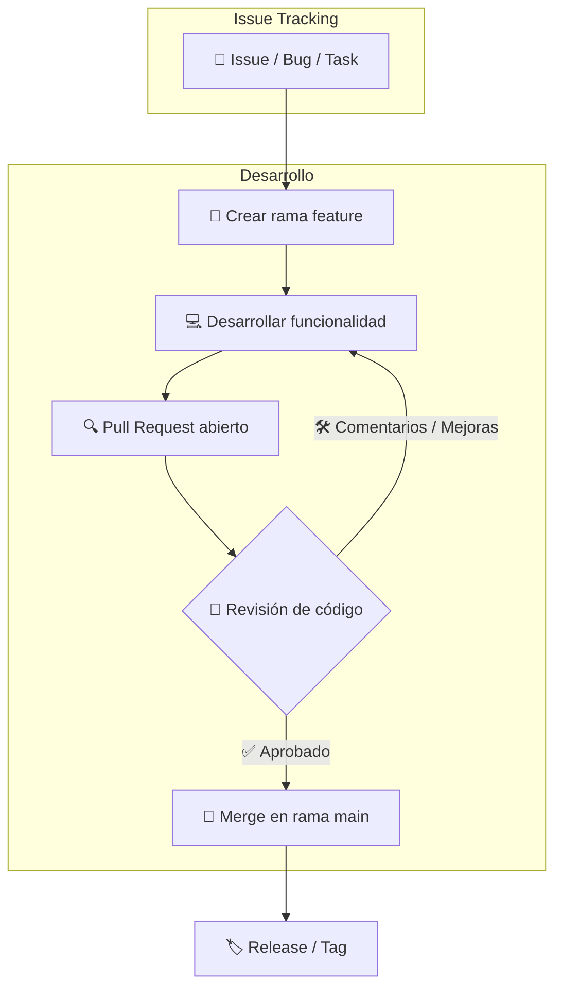

# Escape del Laberinto: Hito 1 🚀

---

## Tabla de contenidos

- [Escape del Laberinto: Hito 1 🚀](#escape-del-laberinto-hito-1-)
  - [Tabla de contenidos](#tabla-de-contenidos)
  - [GDD básico 📝](#gdd-básico-)
    - [¿En que consiste nuestro juego?](#en-que-consiste-nuestro-juego)
      - [Componentes y mecánicas principales](#componentes-y-mecánicas-principales)
  - [Elección de estrategia de gestión de ramas 🌿](#elección-de-estrategia-de-gestión-de-ramas-)
    - [Flujo de trabajo](#flujo-de-trabajo)
    - [Ejemplo de Pull Request](#ejemplo-de-pull-request)
    - [Ejemplo de rama feature](#ejemplo-de-rama-feature)
  - [Sistema de bugtracking elegido 🐛](#sistema-de-bugtracking-elegido-)
    - [Ejemplo de Issue](#ejemplo-de-issue)
  - [Conclusiones ✅](#conclusiones-)
  - [Autores ✍️](#autores-️)

---

## GDD básico 📝

### ¿En que consiste nuestro juego?

Nuestro juego consiste en un ***Escape del Laberinto***, es decir, el jugador tiene que pasar a través de pasillos, esquivando trampas y enemigos, a la vez que resolviendo mecanismos para pasar a través de estos para llegar a la salida

#### Componentes y mecánicas principales
- Jugador:
  - El jugador se puede mover en todas las direcciones. (Sin diagonales)
  - El jugador tiene 5 vidas, es decir, puede recibir hasta 5 golpes de obstáculos/enemigos.
  - El jugador tiene una mochila para indicar los objetos que lleva en ese momento o recoge por el camino. De momento una llave para poder salir del laberinto.
  - El jugador puede llegar a la meta para superar el nivel.
  - El jugador puede activar botones y palancas.
-  Mecanismos:
   - Los mecanismos no se pueden atravesar por el jugador si no son activados por su activador.
- Enemigos:
  - Los enemigos recorren el laberinto aleatoriamente.
  - Los enemigos pueden quitarle vidas al jugador al colisionar con estos. 
- Pinchos:
  - Los pinchos cuando se muestran pueden quitarle vidas al jugador al colisionar con estos. 
  - Los pinchos se pueden atravesar por el jugador si están ocultos.

---

## Elección de estrategia de gestión de ramas 🌿

Para la gestión de nuestro repositorio del proyecto ***Escape del Laberinto***, hemos optado por la estrategia **GitHub Flow**. Esta elección se basa en la naturaleza ágil y colaborativa del desarrollo de nuestro juego, que requiere iteraciones frecuentes sobre el código y una integración continua de las funcionalidades desarrolladas por cada miembro del equipo.

**GitHub Flow** se adapta perfectamente a nuestro proyecto porque:

- Permite trabajar con **ramas cortas y específicas**, dedicadas a nuevas características o correcciones puntuales. Cada desarrollador puede crear su propia rama a partir de `main` para implementar funcionalidades como la lógica de movimiento, la gestión de enemigos o el sistema de estados del juego.
- Facilita la **revisión de código mediante Pull Requests**, asegurando que cualquier cambio que se integre en `main` sea previamente revisado por al menos otro miembro del equipo. Esto mejora la calidad del código y minimiza errores antes de la integración.
- Se centra en **despliegues frecuentes y seguros**, lo que nos permite mantener `main` siempre en un estado jugable y funcional, incluso durante el desarrollo activo de nuevas mecánicas o pantallas.
- Mantiene el flujo simple y flexible, evitando la complejidad que podría introducir **GitFlow**, más orientado a proyectos con ciclos de release definidos y múltiples ramas intermedias.

### Flujo de trabajo

1. Crear una rama `feature/nombre-feature` a partir de `main`.
2. Implementar la funcionalidad o corrección correspondiente.
3. Abrir un **Pull Request** hacia `main` para revisión de cambios.
4. Una vez aprobado, fusionar la rama y eliminarla local y remotamente.
5. Mantener `main` siempre en estado estable y jugable, permitiendo generar releases fácilmente.

### Ejemplo de Pull Request

| Pull Request | Estado | Etiquetas | Asignado a |
|--------------|--------|-----------|------------|
| `PR #5: Implementar movimiento jugador` | ✅ Aprobado | `feature`, `ready-for-merge` | Fernando |
| `PR #7: Corrección colisiones` | 🛠 En revisión | `bug`, `needs-review` | Alex |

### Ejemplo de rama feature

```text
feature/1-mapa-estatico
feature/5-crear-estado-GameOver
hotfix/8-collision-bug
```

**Esquema visual de GitHub Flow:**



Este diagrama representa cómo un *issue* inicia el flujo de trabajo, pasando por la creación de una rama específica, desarrollo, revisión mediante *Pull Request* y finalmente la integración en `main` con la generación de una release estable.

Esta metodología asegura que todos los desarrolladores en el equipo podamos trabajar de manera independiente, mientras `main` refleja el estado consolidado y funcional del juego.

---

## Sistema de bugtracking elegido 🐛

Para el seguimiento de incidencias y control de errores, nos hemos decantado por **GitHub Issues** como sistema de ***bugtracking***. Esta decisión se fundamenta en varias razones:

- **Integración directa con GitHub**, nuestro repositorio central, lo que permite asociar *issues* directamente a commits y *Pull Requests*.
- **Simplicidad y claridad**: cada *bug*, tarea o mejora se puede documentar en un issue individual con título, descripción, etiquetas, asignación de responsables y estado.
- **Colaboración eficiente**: todos los miembros del equipo pueden comentar, actualizar el estado y cerrar issues de manera transparente, facilitando la comunicación y seguimiento de tareas.
- **Vinculación con milestones y releases**: podemos asociar *issues* a cada hito o versión del juego, permitiendo un control claro de qué tareas se han completado y cuáles están pendientes.

### Ejemplo de Issue

| Issue | Estado | Etiquetas | Asignado a |
|-------|--------|-----------|------------|
| `#12: Jugador atraviesa paredes` | ⚠ Abierto | `bug`, `high-priority` | Esther |
| `#15: Añadir sonidos al recoger power-ups` | ✅ Cerrado | `feature`, `audio` | Hugo |
| `#18: Mejora IA enemigos` | ⏳ En progreso | `enhancement`, `AI` | Alex |
| `#21: Pantalla de Game Over falta botón reiniciar` | ⚠ Abierto | `bug`, `UI` | Fernando |

Al utilizar **GitHub Issues**, conseguimos centralizar la gestión de bugs y tareas en la misma plataforma que usamos para el código, simplificando la administración del proyecto y asegurando trazabilidad completa de los cambios implementados.

---

## Conclusiones ✅

Gracias a GitHub Flow y GitHub Issues, nuestro equipo mantiene main siempre estable y funcional, facilita la colaboración, asegura la revisión de cada cambio y permite asociar tareas y bugs directamente a commits y Pull Requests. Esto garantiza un desarrollo más ordenado, controlado y transparente, ideal para proyectos colaborativos como Escape del Laberinto.

---

## Autores ✍️

- **Esther Peral Soler**
- **Hugo Redondo Valdés**
- **Alejandro Montoya Aracil**
- **Juan Fernando Ganim Iborra**
