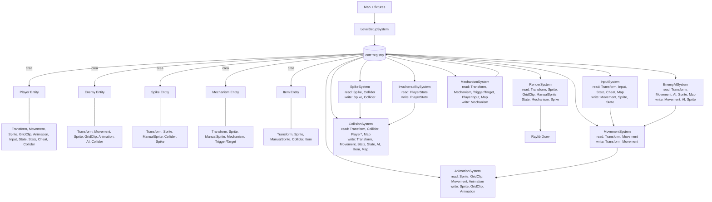

# Implementación del patrón ECS (Entity Component System)

Esta implementación adopta **ECS** usando **EnTT** (`vendor/include/entt/entt.hpp`) como motor. El objetivo es **desacoplar datos de comportamiento**, favorecer la **composición** frente a la herencia y permitir que el juego trate las entidades del mundo como **combinaciones de componentes (datos puros)** procesadas por **sistemas** (lógica) especializados.

---

## 1) Visión general

### Conceptos base
- **Entidades**: identificadores sin lógica propia (`entt::entity`), creados y gestionados desde un `entt::registry`.
- **Componentes**: `structs` simples (datos puros) ubicados en `src/ecs/components/`, agrupados por dominio.
- **Sistemas**: funciones libres en `src/ecs/systems/` que operan sobre vistas del registro (`registry.view<...>()`) y aplican la lógica del juego.

### Punto de entrada
- Punto de entrada central: `src/ecs/Ecs.hpp`, que **agrega** (incluye) componentes y sistemas para su uso desde los estados del juego.

---

## 2) Estructura del código

### Componentes (`src/ecs/components/`)
Agrupación por dominio (orientativo):
- **World**
  - `TransformComponent`, `MovementComponent`, `SpriteComponent`, `AnimationComponent`
  - `ColliderComponent`, `SpikeComponent`, `MechanismComponent`, etc.
- **Player**
  - `PlayerInputComponent`, `PlayerStateComponent`, `PlayerStatsComponent`, `PlayerCheatComponent`
- **Enemy**
  - `EnemyAIComponent`

### Sistemas (`src/ecs/systems/`)
Sistemas implementados como funciones (sin estado global) que procesan entidades por **arquetipos** (conjuntos de componentes).

---

## 3) Registro y ciclo de juego

### Dónde vive el `registry`
- El `entt::registry` vive en `src/core/MainGameState.hpp` y se utiliza en el bucle principal del juego.

### Modelo de datos y consultas
- El `registry` mantiene **almacenamientos por tipo de componente** y expone **vistas** (`view<...>()`) para iterar **arquetipos** (conjuntos de componentes).
- Los sistemas no dependen de clases concretas: consumen datos por **presencia de componentes**, lo que reduce acoplamiento y permite extender comportamiento mediante composición.

### Ciclo principal
1. **Creación de entidades**
   - `LevelSetupSystem(...)` en `src/ecs/systems/LevelSetupSystem.cpp`
   - Interpreta `Map` y genera entidades (jugador, enemigos, pinchos, llaves, mecanismos, etc.).

2. **Update**
   - En `MainGameState::update(...)` (`src/core/MainGameState.cpp`) con el siguiente orden:

   - `InputSystem`
   - `EnemyAISystem`
   - `MovementSystem`
   - `AnimationSystem`
   - `SpikeSystem`
   - `InvulnerabilitySystem`
   - `CollisionSystem`
   - `MechanismSystem`

3. **Render**
   - `_renderMap()` usa `RenderSystem(...)`.
   - Existe además un **registro separado** para el preview en `SelectPlayerState` (evita contaminar el estado del mundo principal).

### Diagrama de flujo (sistemas/entidades)



### Justificación del orden de sistemas
El orden está diseñado para evitar inconsistencias:
- **Input → Movement**: el input decide destino y configuración de movimiento.
- **Movement → Animation**: la animación responde al estado de movimiento/idle.
- **Spike/Invulnerability/Collision**: primero se actualiza el estado de peligros e invulnerabilidad, luego se resuelven impactos.
- **Mechanism al final**: reacciona al estado resultante del jugador (posición final, triggers activados, etc.).

---

## 4) Componentes clave y su rol

- `TransformComponent`
  - Posición y tamaño en mundo (base para render y colisiones).
- `MovementComponent`
  - Movimiento por casillas con interpolación temporal (`startPos`, `targetPos`, progreso, duración).
- `SpriteComponent` + `GridClipComponent` + `AnimationComponent`
  - Render animado basado en spritesheet (grid) o sprite fijo.
- `ManualSpriteComponent`
  - Recortes manuales para sprites que no siguen una grilla (pinchos, mecanismos, etc.).
- `ColliderComponent` + `CollisionType`
  - Hitboxes y categorización (Player, Enemy, Spike, Item, etc.).
- `MechanismComponent` + `MechanismTriggerComponent` + `MechanismTargetComponent`
  - Enlazan trigger/target por un `id` lógico (permite conectar elementos del mapa sin referencias directas).
- `PlayerStateComponent`
  - Invulnerabilidad y última casilla válida (útil para rollback o correcciones tras colisión).
- `EnemyAIComponent`
  - Estado y temporizadores para `Patrol / Chase / Retreat` (y reglas de transición).

---

## 5) Sistemas y comportamiento

- **InputSystem**
  - Detecta input, calcula celda destino, actualiza `MovementComponent` y orienta sprite.
- **MovementSystem**
  - Interpola posición desde `startPos` a `targetPos` según `deltaTime`.
- **AnimationSystem**
  - Alterna frames/texturas según si la entidad camina o está idle.
- **SpikeSystem**
  - Activa/desactiva pinchos en intervalos, sincronizando estado visual y collider.
- **InvulnerabilitySystem**
  - Gestiona ventanas temporales de invulnerabilidad del jugador (y su caducidad).
- **CollisionSystem**
  - Resuelve colisiones jugador vs peligros/objetos: reduce vidas, aplica invulnerabilidad, recoge ítems, etc.
- **EnemyAISystem**
  - Cambia entre `Patrol/Chase/Retreat` usando line-of-sight y reglas como bloqueo por mecanismos.
- **MechanismSystem**
  - Detecta triggers en la celda del jugador y desactiva la pareja trigger/target asociada.
- **LevelSetupSystem**
  - Lee `Map` y genera entidades iniciales (incluyendo enlaces de mecanismos).
- **RenderSystem**
  - Dibuja entidades según combinación de componentes, con reglas de recorte (grid/manual) y escalado.

### Consideraciones técnicas
- Los sistemas son **funciones puras** respecto al estado del `registry`: no guardan estado global y dependen de los componentes presentes.
- La orquestación del frame ocurre en `MainGameState::update(...)`, por lo que **el orden de ejecución es explícito** y fácil de auditar.
- Para render se reutiliza la misma representación de datos (componentes), evitando dobles estructuras para lógica/visual.

---

## 6) Flujo de datos e integración con código existente

El ECS no vive aislado: se integra con clases ya existentes del proyecto:

- `Map` (`src/objects/Map.*`)
  - Aporta tiles, walkability, y definiciones de mecanismos.
- `ResourceManager`
  - Gestiona texturas cargadas desde assets (y evita recargas innecesarias).
- `PlayerSelection` y `PlayerSpriteCatalog`
  - Alimentan la selección/catálogo de sprites del jugador.

Esto permite introducir ECS **sin reescribir** todo el subsistema de carga, recursos y estados, manteniendo compatibilidad con el código legado.

---

## 7) Ejemplo mínimo de entidad

```cpp
auto e = registry.create();
registry.emplace<TransformComponent>(e, Vector2{cx, cy}, Vector2{tile, tile});
registry.emplace<SpriteComponent>(e, tex, Vector2{0,0}, 1.0f);
registry.emplace<ColliderComponent>(e, Rectangle{-w/2, -h/2, w, h}, CollisionType::Item);
registry.emplace<ItemComponent>(e, true);
```

Con esta combinación:

* El **render** la dibuja por `TransformComponent` + `SpriteComponent`.
* El **sistema de colisiones** la trata como **ítem recolectable** por `ColliderComponent` + `CollisionType::Item` + `ItemComponent`.

---

## 8) Migración de POO a ECS: dificultades y decisiones

La migración a ECS se realizó en un punto **relativamente avanzado** del desarrollo, cuando ya existían clases POO (por ejemplo, en `src/objects/`) y flujos de juego estables. Esto implicó:

* **Compatibilidad temporal**

  * Fue necesario mantener estructuras antiguas (mapa, recursos, estados) mientras la lógica se trasladaba a ECS.
* **Puentes y duplicidad parcial**

  * Algunas responsabilidades coexistieron durante la transición (p. ej., creación de entidades en `LevelSetupSystem` y validaciones todavía en `MainGameState`).
* **Reasignación de responsabilidades**

  * Funcionalidad antes embebida en clases pasó a sistemas independientes, obligando a definir explícitamente el **orden de ejecución** y los **puntos de integración**.
* **Reestructuración de datos**

  * Atributos antes encapsulados en objetos (posición, animación, colisiones) se distribuyeron en componentes, requiriendo revisar accesos y dependencias.
* **Adaptación de render y recursos**

  * Se adaptó el render para leer componentes (`SpriteComponent`, `GridClipComponent`, `ManualSpriteComponent`, etc.) sin romper rutas de assets y gestión de texturas existente.

### Resultado

El resultado es un ECS funcional que **convive** con código legado, ofreciendo:

* un flujo de datos más explícito,
* mayor escalabilidad,
* y la posibilidad de ampliar comportamiento por **composición** (añadiendo componentes/sistemas) en lugar de por herencia.
